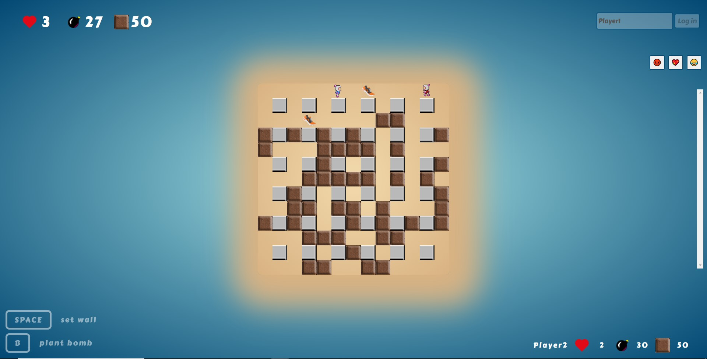
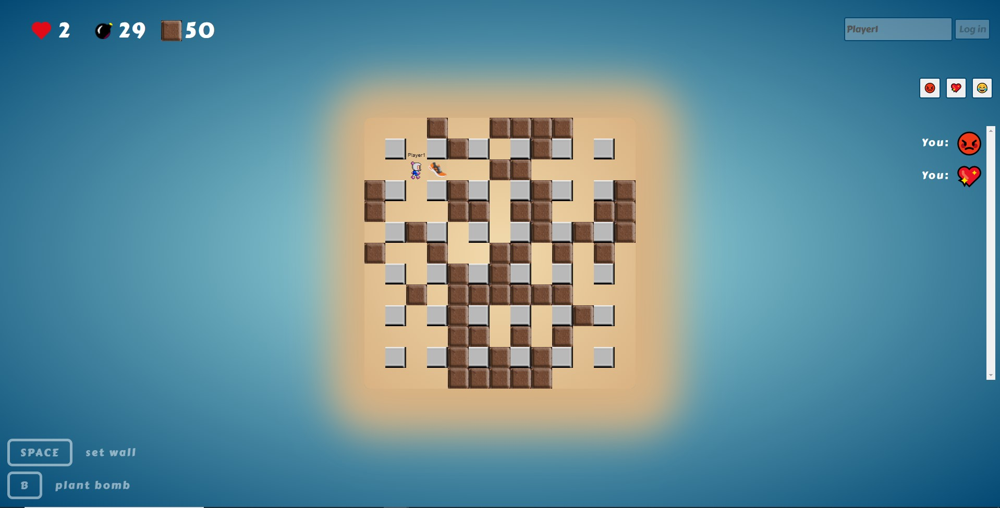
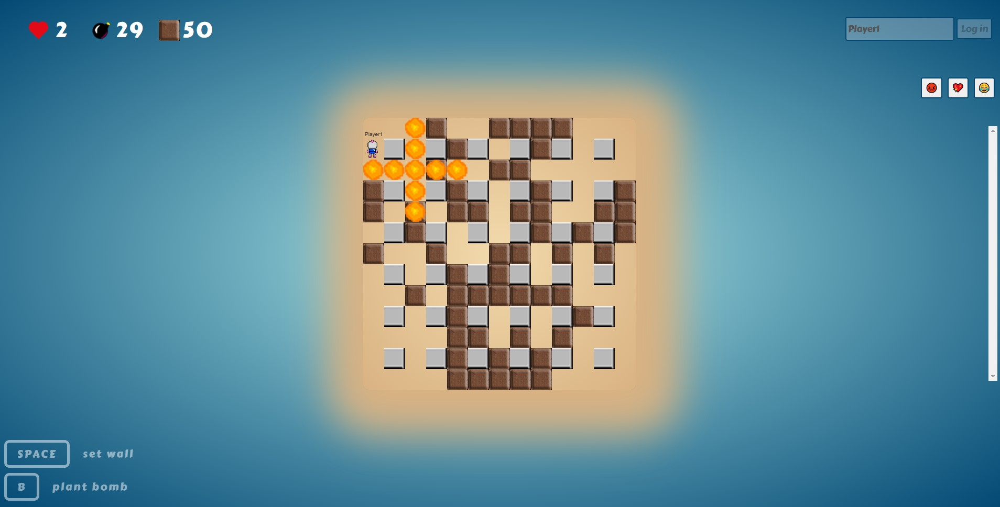
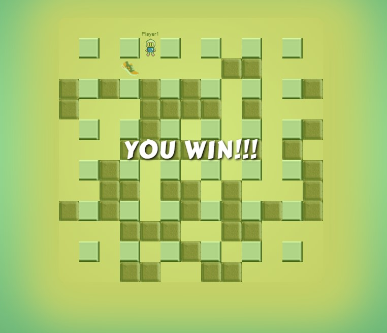

# Bomberman Multiplayer Game



#Download
```bash
git clone https://github.com/akafounis/Bomberman
```

#Install
```bash
npm install
```

#Run
To build your bundle, run:
```bash
npm run build
```
or
```bash
webpack
```
This will create the `./dist` folder

To start the server:
```bash
node server
```
for development use (auto refresh):
```bash
nodemon server
```


Now open your browser and visit http://localhost:9000/ to play the game!



You can build walls to block your opponents way and you can also plant bombs to destroy walls and damage your opponents. Inside some walls there are perks that can boost your actions.




To win the game you have to kill your opponent



